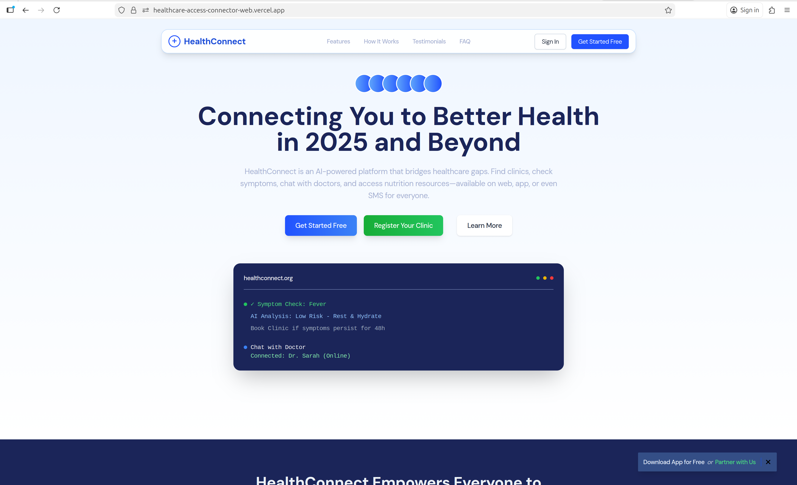

# Healthcare Access Connector - Frontend 🏥

[](https://reactjs.org/)
[](https://tailwindcss.com/)
[](https://opensource.org/licenses/MIT)
[](https://healthcare-access-connector-web.vercel.app)



## 🚀 Overview

**Healthcare Access Connector** is a comprehensive healthcare platform built on Horizon UI, designed to bridge the gap between patients and healthcare providers in underserved communities. This application enables seamless access to healthcare services through three distinct user interfaces: **Patients**, **Healthcare Providers**, and **System Administrators**.

> **🌐 Live Demo**: [https://healthcare-access-connector-web.vercel.app](https://healthcare-access-connector-web.vercel.app)

> **Note**: This project is a transformation of the original Horizon UI template into a specialized healthcare application.

## ✨ Key Features

### 👨‍⚕️ **Multi-Role Platform**

- **Patient Portal**: Find clinics, check symptoms, book appointments, access nutrition tips
- **Provider Portal**: Manage appointments, conduct telemedicine consultations, view patient queues
- **Admin Portal**: System monitoring, clinic verification, user management, analytics

### 🏥 **Core Functionalities**

- **Clinic Finder**: Map-based clinic search with filters for services, availability, and distance
- **Symptom Checker**: AI-powered symptom assessment and triage recommendations
- **Telemedicine**: Secure chat interface for remote consultations
- **Appointment Management**: Calendar-based booking system with SMS reminders
- **Nutrition Library**: Age-specific nutrition guides and resources
- **SMS Integration**: Support for low-tech users without smartphones

### 📱 **User-Centric Design**

- Responsive design for mobile and desktop
- Dark/Light mode toggle
- Intuitive navigation for all user types
- Accessibility-focused interface
- Progressive Web App (PWA) capabilities

## 🌐 Access the Application

### Live Deployment

Visit the deployed application at:
**[https://healthcare-access-connector-web.vercel.app](https://healthcare-access-connector-web.vercel.app)**

### Local Development

Follow the [Quick Start](#-quick-start) instructions below to run the application locally.

## 🏗️ Architecture

```
src/
├── layouts/              # Role-based layouts
│   ├── patient/         # Patient interface layout
│   ├── provider/        # Healthcare provider layout
│   └── admin/           # System administrator layout
├── views/               # Application pages
│   ├── patient/         # Patient-facing views
│   ├── provider/        # Provider-facing views
│   └── admin/           # Admin-facing views
├── components/          # Reusable components
│   ├── navbar/          # Role-specific navigation bars
│   ├── sidebar/         # Role-specific sidebars
│   └── charts/          # Data visualization components
└── routes.js            # Role-based routing configuration
```

## 🚀 Quick Start

### Prerequisites

- Node.js 16+ and npm/yarn
- Git

### Installation

1. **Clone the repository**

```bash
git clone https://github.com/nyashahama/healthcare-access-connector-frontend.git
cd healthcare-access-connector-frontend
```

2. **Install dependencies**

```bash
npm install
# or
yarn install
```

3. **Start development server**

```bash
npm start
# or
yarn start
```

The application will run at `http://localhost:3000`

### Build for Production

```bash
npm run build
# or
yarn build
```

## 👥 User Roles & Access

### 1. **Patient/Caregiver**

- **Access**: `/patient/*`
- **Live**: [https://healthcare-access-connector-web.vercel.app/patient](https://healthcare-access-connector-web.vercel.app/patient)
- **Features**:
  - Find nearby clinics
  - Symptom checking and triage
  - Appointment booking
  - Telemedicine consultations
  - Nutrition resources
  - Health history tracking

### 2. **Healthcare Provider**

- **Access**: `/provider/*`
- **Live**: [https://healthcare-access-connector-web.vercel.app/provider](https://healthcare-access-connector-web.vercel.app/provider)
- **Features**:
  - Appointment calendar management
  - Patient queue monitoring
  - Telemedicine consultations
  - Clinic profile management
  - Patient records access

### 3. **System Administrator**

- **Access**: `/admin/*`
- **Live**: [https://healthcare-access-connector-web.vercel.app/admin](https://healthcare-access-connector-web.vercel.app/admin)
- **Features**:
  - System health monitoring
  - Clinic verification and approval
  - User management
  - Content management
  - Analytics and reporting

## 🎨 Design System

This project extends Horizon UI with healthcare-specific components:

- **Healthcare Color Palette**: Professional blues, greens, and purples
- **Medical Icons**: Custom healthcare icon set
- **Role-Specific UI**: Tailored interfaces for each user type
- **Accessibility**: WCAG 2.1 compliant components

## 📊 Technology Stack

- **Frontend Framework**: React 19
- **Build Tool**: react-scripts (Create React App)
- **HTTP Client**: Axios
- **Routing**: React Router 6
- **Styling**: Tailwind CSS 3.3
- **Charts**: ApexCharts (for data visualization)
- **Icons**: React Icons
- **Package Manager**: npm/yarn
- **Deployment**: Vercel

## 🔧 Configuration

### Environment Variables

Copy `.env.example` and set:

```env
REACT_APP_API_URL=http://localhost:8080
REACT_APP_WS_URL=ws://localhost:8080
REACT_APP_ENVIRONMENT=development
```

## 📱 SMS Integration (Planned)

For users without smartphones:

```
Text 'HELP' to 12345 for:
1 - Find a free clinic
2 - Nutrition tips
3 - Book a callback
4 - Speak to agent
```

## 🧪 Testing

Run test suite:

```bash
npm test
# or
yarn test
```

## 📁 Project Structure

```
healthcare-access-connector-frontend/
├── public/                 # Static assets
├── src/
│   ├── assets/            # Images, fonts, styles
│   ├── components/        # Reusable components
│   │   ├── charts/        # Data visualization
│   │   ├── fields/        # Form fields
│   │   ├── footer/        # Footer components
│   │   ├── navbar/        # Role-specific navbars
│   │   ├── sidebar/       # Role-specific sidebars
│   │   └── widget/        # Dashboard widgets
│   ├── layouts/           # Application layouts
│   ├── views/             # Page components
│   │   ├── auth/          # Authentication pages
│   │   ├── patient/       # Patient portal
│   │   ├── provider/      # Provider portal
│   │   └── admin/         # Admin portal
│   ├── App.jsx            # Main application component
│   ├── index.js           # Application entry point
│   └── routes.js          # Route configuration
├── package.json           # Dependencies and scripts
└── README.md              # This file
```

## 🚀 Deployment

This application is deployed on Vercel. To deploy your own instance:

1. Fork this repository
2. Connect your repository to Vercel
3. Configure environment variables in Vercel dashboard
4. Deploy with automatic CI/CD

Visit the live application: **[https://healthcare-access-connector-web.vercel.app](https://healthcare-access-connector-web.vercel.app)**

## 🤝 Contributing

We welcome contributions! Please see our [Contributing Guidelines](CONTRIBUTING.md) for details.

1. Fork the repository
2. Create a feature branch (`git checkout -b feature/AmazingFeature`)
3. Commit your changes (`git commit -m 'Add some AmazingFeature'`)
4. Push to the branch (`git push origin feature/AmazingFeature`)
5. Open a Pull Request

## 📄 License

This project is licensed under the MIT License - see the [LICENSE](LICENSE) file for details.

## 🙏 Acknowledgments

- Built on [Horizon UI Tailwind React](https://horizon-ui.com/)
- Medical icons from [React Icons](https://react-icons.github.io/react-icons/)
- Design inspiration from modern healthcare platforms
- Deployed on [Vercel](https://vercel.com)
- Special thanks to the open-source community

## 📞 Support

For support, email [nyashahama55@gmail.com] or open an issue in the GitHub repository.

## 🔗 Links

- **Live Application**: [https://healthcare-access-connector-web.vercel.app](https://healthcare-access-connector-web.vercel.app)
- **GitHub Repository**: [https://github.com/nyashahama/healthcare-access-connector-frontend](https://github.com/nyashahama/healthcare-access-connector-frontend)
- **Documentation**: [Coming Soon]

---

**Made with ❤️ for better healthcare access**
